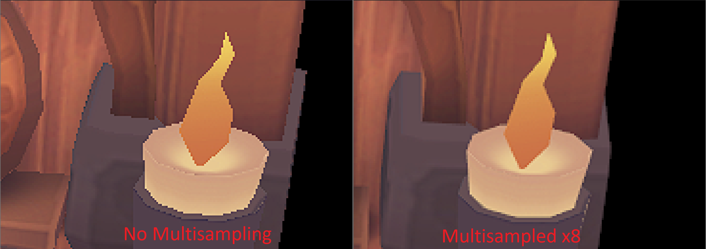
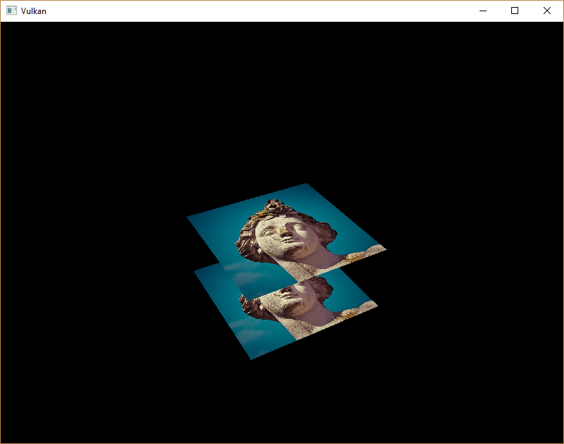

# 3D Rendering in Vulkan

This repository showcases my comprehensive work and completed projects 
from the famous Vulkan Tutorial website tutorials. Throughout this 
learning journey, I have gained a deep understanding of Vulkan, a 
powerful and efficient graphics and compute API.


Learning Vulkan can be a challenging endeavor, but I have managed to make significant progress by maintaining a consistent approach. Throughout my learning journey, one skill that has proven to be of utmost importance is the utilization of validation layers for debugging Vulkan errors. This ability to effectively understand validation layers has empowered me to identify and resolve issues.


---


## Things  learnt so far..

1. **Mutlisampling antialiasing**
   
   

2. **Mipmapping**
   
   

3. **Texture Mapping and Depth Buffering**
   
   

4. **Descriptor Pools, Descriptor Sets & Uniform Buffers**
   
   ```glsl
   #version 450
   
   layout(binding=0) uniform UniformBufferObject {
   	mat4 model;
   	mat4 view;
   	mat4 proj;
   } ubo;
   
   ```

5. **Vertex Buffer, Index Buffer, Staging Buffer**

6. **Vulkan Setup, Validation Layers and the Triangle!**
   
   

# 

## Credits

I would like to express my gratitude to the creators of the [Vulkan Tutorial website](https://vulkan-tutorial.com/), which served as the foundation for my learning journey. Their dedication to providing comprehensive and well-explained tutorials has been invaluable in helping me gain a deep understanding of Vulkan.